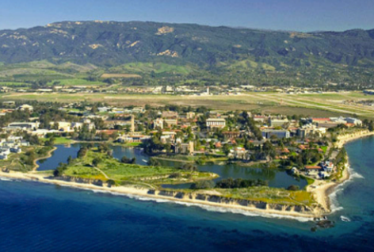

The LVG is a research group located in the [Department of Education](https://education.ucsb.edu/education) at the [University of California, Santa Barbara](http://w.ucsb.edu/). We are a collection of diverse researchers, both statisticians and substantive researchers, professors and graduate students, all who share an interest in latent variable models. This includes factor analytic models, mixture models, latent growth models, latent transition analysis, and lots of other topics.\
Our research activities range from collaborative joint projects, statistical consulting, methodological symposia, and pedagogical workshops.

{width="200"}

{width="200"}
