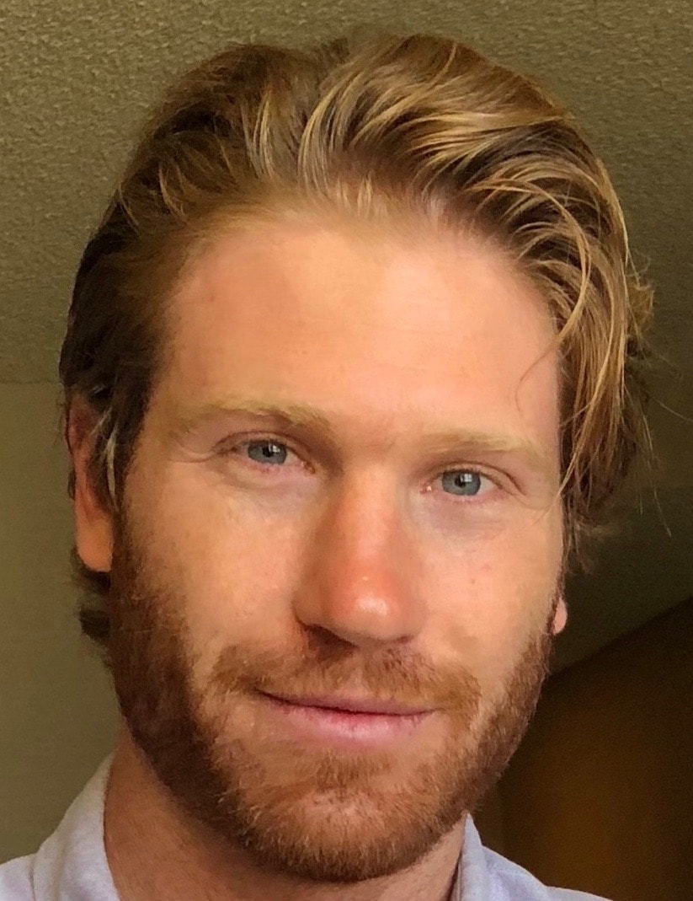

```{r setup, include=FALSE}
knitr::opts_chunk$set(echo = FALSE)
```

## LVG Director {style="text-align: center"}

### Dr. Karen Nylund-Gibson {style="text-align: center"}
###  {style="float: left; padding: 0 20px 20px 0; text-align: center"}
Karen Nylund-Gibson is an Associate Professor of Quantitative Methods in the Gevirtz Graduate School of Education at the University of California, Santa Barbara. She graduated in 2007 from the University of California, Los Angeles with a Ph.D. in advanced quantitative methods with an emphasis in latent variable modeling under the mentorship of Bengt Muthén. Before joining the faculty at UCSB, she was an NIMH Postdoctoral Fellow through a Prevention Science training grant at the Department of Mental Health at Johns Hopkins University. As a quantitative methodologist, her research interests are in the development and application of latent variable models, specifically mixture models including latent class and profile analysis, and latent Markov models. She has substantive research interests in peer victimization, STE(A)M education, and the modeling of anti-social behavior.

##

## Graduate Students {style="text-align: center"}

### Dina Naji Arch, M.A. {style="text-align: center"}
###  {style="float: left; padding: 0 20px 20px 0; text-align: center"}
Dina is a second-year doctoral student in the Department of Education with an emphasis in quantitative methods under the guidance of Dr. Karen Nylund-Gibson. She earned her B.S. from UC San Diego in Psychology and minored in Business. She later received her M.A. in Psychology with a focus in quantitative methods from California State University, Fullerton. Her broad research interests include longitudinal methods and latent variable analyses, such as structural equation modeling and mixture modeling. Currently, she is working with the Latent Variable Group to create user-friendly data visualization tools for latent variable analyses.

## 

### Delwin Carter, M.A. {style="text-align: center"}
###  {style="float: left; padding: 0 20px 20px 0; text-align: center"}
Delwin Carter is a doctoral student emphasizing in quantitative methods. His advisor is Karen Nylund-Gibson. He received his B.A. in Psychology and M.A. in Experimental Psychology at California State University, Northridge. His broad interests include latent variable analysis, measurement, and structural equation modeling. More specifically, he has done research in several substantive areas including peer victimization, perceived discrimination, and depression. Methodologically speaking, his current research involves factor analysis, measurement invariance, item-order effects, and explaining variance in mixture models.

##

### Andrew Y. Choi, Ph.D. {style="text-align: center"}
### {width="135"} {style="float: left; padding: 0 20px 20px 0; text-align: center"}
Andy is a doctoral candidate in the Department of Counseling, Clinical, and School Psychology with an emphasis in Quantitative Methods in Social Sciences. He is also pursuing an MA in Research Methodology. He graduated magna cum laude from the University of Utah in 2013 with honors degrees (HBS) in Psychology and Sociology. His research interests involve applications of latent variable modeling to understand population heterogeneity and mental health needs of diverse constituents, including racial/ethnic minorities. Specific interests include factor models, scale development, and mixture models (e.g., latent class analysis) as they apply to identity development, intersectionality, prejudice, and other substantive topics.

##

### Adam C. Garber, M.A. {style="text-align: center"}
### {width="135"} {style="float: left; padding: 0 20px 20px 0; text-align: center"}
Adam is a doctoral student in the department of education with interest in making quantitative methodological developments accessible to special education researchers. He has been working with children and young adults with developmental disabilities for the past six years in Santa Barbara. Interests related to quantitative methods include: structural equation modeling, mixture modeling, causal inference, modeling applications with big data, and machine learning (natural language processing). He received a bachelor's degree from the University of California, Santa Cruz in Psychology during which time he worked at a psychiatric hospital helping treat people with severe mental illness. Further aspirations include facilitating cross-disciplinary research and he currently is pursuing interdisciplinary emphases in Quantitative Methods in the Social Sciences (QMSS) and Cognitive Science at UCSB.

##

### Odelia Simon, M.S.Ed, M.A. {style="text-align: center"}
### {width="135"} {style="float: left; padding: 0 20px 20px 0; text-align: center"}
Odelia (Lia) is a doctoral student in the department of education working with Drs. Karen Nylund-Gibson and Rebeca Mireles-Rios. She received a BA from Barnard College and an M.S.Ed in human development from the University of Pennsylvania's Graduate School of Education. Her research interests focus on latent variable group differences, both methodologically and substantively. This includes research on STEM, students' school experiences, educational equity, and in the emerging field of quantcrit, applying critical race theory to quantitative methods.

##
## LVG Alumni

Smaranda Lawrie

Dr. Kelly Whaling

Dr. Amber Gonzalez **Assistant Professor at Sacramento State University**

Dr. Shelley Hart **Assistant Professor at Chico State University**

Dr. Ryan Grimm **Assistant Professor at Sacramento State University**

##
## Affiliates

[Dr. Amy Bellmore](https://edpsych.education.wisc.edu/people/faculty-staff/amy-bellmore)

[Dr. Marsha Ing](http://facultyprofiles.ucr.edu/gsoe_dept/faculty/Marsha_Ing/)

[Dr. Katherine Masyn](http://publichealth.gsu.edu/profile/katherine-masyn/)

[Dr. Adrienne Nishina](http://humandevelopment.ucdavis.edu/people/Adrienne_Nishina.php)
